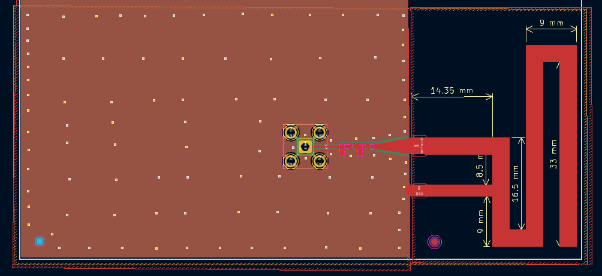
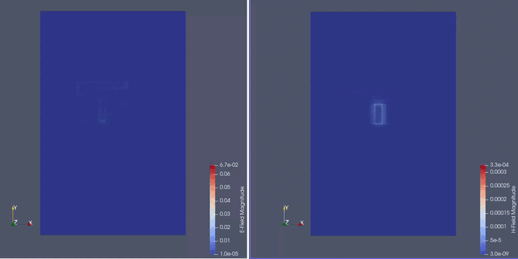

# Lorawan Meandered Monopole

This repository contains simulations data used for tuning an 868 MHz meandered monopole antenna. The kicad-schematics can be found in my [RF-lna-project](https://github.com/igorwolfs/RF-lna-project/tree/main/kicad)-repo.

The antenna design itself was losely based on the DN024 antenna by TI.

## Goal
- Design an antenna that would resonate at 868 MHz, without requiring much matching, that could be used for LoRa-communication.
- Gain a feel of what effects monopole resonance and impedance
	- Adding meanders
	- Decreasing / Increasing width
	- Decreasing / Increasing length
	- Adding stubs
	- Adding 2-layered antenna / ground planes traces connected by vias

## Design

The full design history with simulations can be found inside the subfolders [here](history/), documentation of the iterative simulations can be found [here](history/history_doc.md), detailing the changes, observations and extra commentary for each iteration.

- For attempt_1-attempt_4, no relevant files were saved except for the s-parameter and impedance curves.
- Starting from attempt_5, the electric and magnetic field simulations are available. They can be viewed through the (opensource) [paraview](https://www.paraview.org/) software package.

For later attempts, S-parameter exports and impedance exports were made to use for matching with [SimNEC](https://www.ae6ty.com/smith_charts/).

## Simulation
Below the final E and H-field output from the OpenEMS simulations of the antenna can be observed.

## Note
OpenEMS is far from ideal for antenna simulations, since it doesn't have basic built-in equations for antennas design, an interactive CAD software, and (most importantly) the possibility to iterate over a range of values for a parameter (e.g.: antenna length / thickness / width / material).